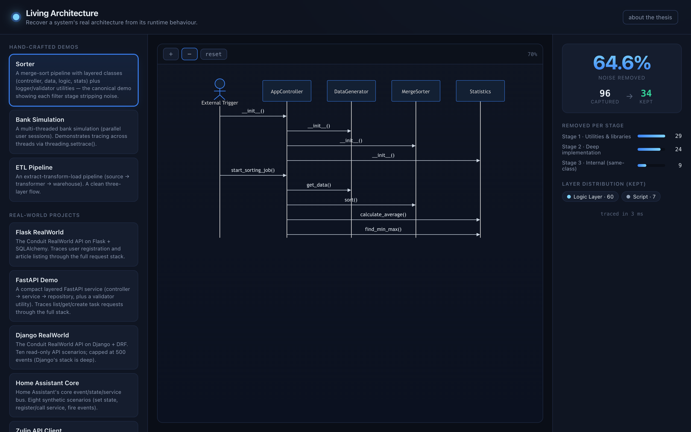
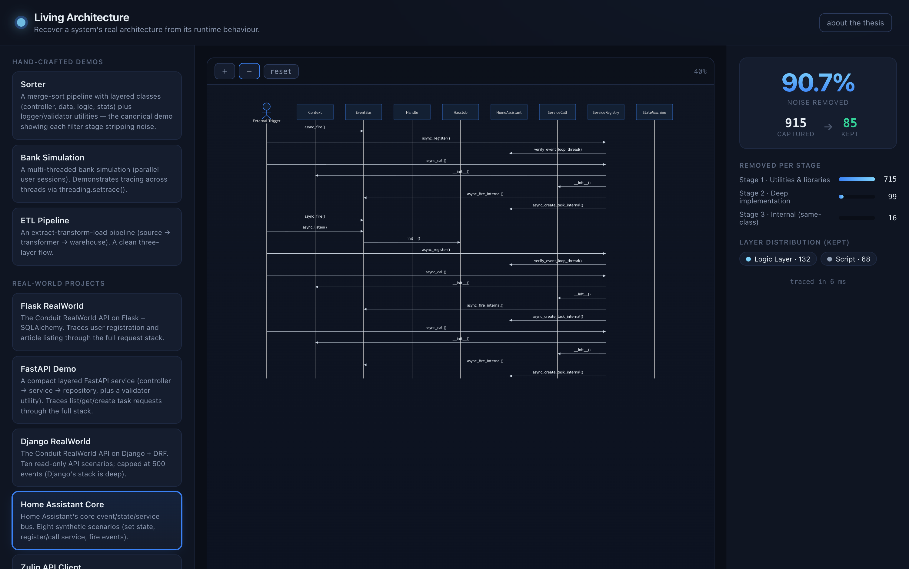

# Living Architecture

Most architecture diagrams describe what a system was *supposed* to look like.
This one is derived from what it actually does at runtime.

The tool runs a Python application under `sys.settrace()`, records every method
call, filters the result down to the calls that carry architectural meaning, and
draws what's left as a UML sequence diagram. The web frontend lets you switch each
filter stage on and off and re-run the trace, so you can see what each stage
actually removes.

Built for my bachelor thesis.



A small layered demo: 96 recorded calls, 34 kept. The rest is logging, validation
and recursion that tells you nothing about how the system is put together.

### On a real codebase

Pointed at Home Assistant's core event/state/service bus, the same pipeline
records 915 calls and keeps 85. What survives is roughly the set of components you
would draw by hand: `EventBus`, `StateMachine`, `ServiceRegistry`, `ServiceCall`.



## The filter

Raw traces are mostly noise. A six-element merge sort produces several hundred
call events, almost all of them recursion and logger calls. Four stages cut it
down:

```
 target app ──▶ ArchitectureTracer (sys.settrace) ──▶ raw call events
                                                          │
                          ArchitectureFilter              ▼
   Stage 1  drop libraries, and utility methods detected by fan-in/fan-out
   Stage 2  drop deep implementation detail (call depth)
   Stage 3  keep only calls that cross a file or class boundary
   Stage 4  classify what survives into architectural layers
                                                          │
                          MermaidGenerator                ▼
                                            sequenceDiagram (rendered in browser)
```

Stage 1 is the interesting one. A method called from many places that calls almost
nothing itself is a utility, not a component: high fan-in, low fan-out. That single
heuristic removes loggers and validators without needing to name them.

Stage 3 encodes the assumption that a call only matters architecturally if it
crosses a boundary. A class calling its own private helper is implementation
detail; a class calling into another file is a relationship worth drawing.

`src/tracer.py` and `src/filter.py` are the thesis core and are frozen. The web
layer wraps them without altering any tracing or filtering behaviour.

## Layout

- `src/` — the engine. `tracer.py`, `filter.py`, `visualizer.py` (PlantUML, the
  original CLI output) and `mermaid_visualizer.py` (browser output).
- `backend/` — FastAPI. `app/runners/` drives each target app, `app/core/`
  serialises trace runs behind a lock, `app/api/` is the JSON API, and
  `app/main.py` also serves the built frontend.
- `frontend/` — React + Vite, renders diagrams with Mermaid.js.
- `applications/` — the eight target apps: three console demos plus Flask,
  Django, Home Assistant, Zulip and a small FastAPI service.

## Running it

```bash
python -m venv .venv && source .venv/bin/activate
pip install --no-deps -r backend/requirements.txt
uvicorn backend.app.main:app --port 8000 --workers 1
```

```bash
cd frontend && npm install && npm run dev     # dev server on :5173, proxies /api
```

Or build the frontend once and let the backend serve it on a single port:

```bash
cd frontend && npm run build                  # outputs into backend/static
```

`--workers 1` is not optional. `sys.settrace()` is process-global, so only one
trace can run at a time; the backend enforces that with an in-process lock, and a
second worker would quietly break it.

Python 3.13 specifically. Home Assistant needs >= 3.13.2, and Pydantic v1 (which
one of the target apps depends on) breaks on 3.14.

## Deploying

There's a `Dockerfile`; any Docker host will do.

```bash
docker build -t living-architecture .
docker run -p 8000:8000 living-architecture
```

The build compiles the frontend in a Node stage, installs the Python
dependencies, and copies in only the target apps that are actually traced.
`.dockerignore` keeps the vendored `.git` directories and test trees out of the
build context, which is most of what would otherwise be a very large image.

## Caveats

The console demos and Home Assistant call their own logic close to the surface,
so Stage 4 produces a clean diagram.

Flask and Django are different. Their application code sits far beneath the HTTP
request stack, and the depth filter removes it along with the framework
internals. For those two the interesting view is the reduction itself: Flask goes
from 558 arrows at Stage 0 down to almost nothing. That's a real limitation of
applying a depth heuristic to a deep framework, not something the demo hides.

The FastAPI target is a small purpose-built service rather than the RealWorld
clone in `applications/external_fastapi`. That clone needs FastAPI ~0.79 and
Pydantic v1, and two versions of `fastapi` can't coexist in one interpreter with
the one the backend itself runs on.
